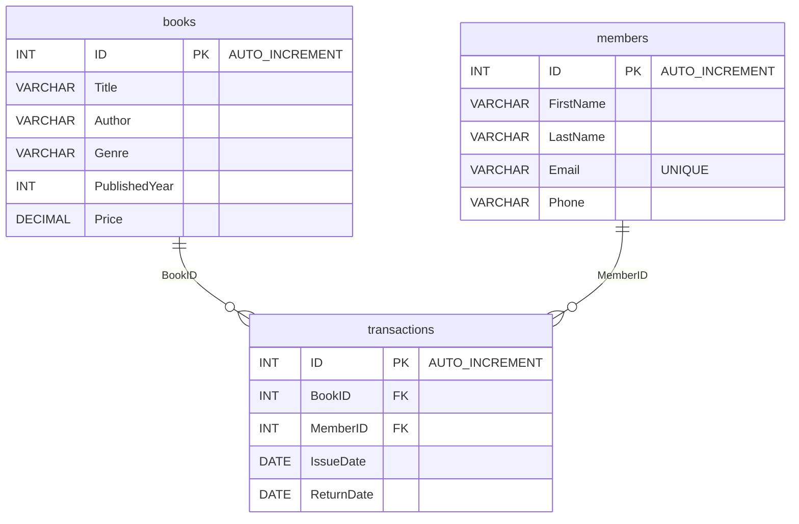

# 📚 Library Management System


A lightweight **Python + MySQL** project for managing books, members, and transactions in a small‑to‑medium‑sized library. Perfect for learning full‑stack CRUD patterns, relational database design, and clean code architecture.

---

## ✨ Features

* **Book & Member CRUD** – add, update, delete, list
* **Issue / Return Workflow** – tracks who borrowed what, when, and for how long
* **Fine Calculation** – automatic late‑fee logic (customisable)
* **Full Transaction Log** – JOINs show book & member names in one view
* **Analytics** – list most‑issued books, inactive members, etc.
* **SQL Utilities** – price increases, bulk discounts, archival deletes
* **Extensible** – ready for CLI, GUI (Tkinter), or web (Flask/Streamlit)

---

## 🏗️ Tech Stack

| Layer        | Tech                             |
| ------------ | -------------------------------- |
| Language     | Python 3.10 +                    |
| Database     | MySQL 8.0 (InnoDB)               |
| Connector    | `mysql‑connector‑python`         |
|  Environment | Works on Windows / macOS / Linux |

---

## 🚀 Quick Start

```bash
# 1 ➜ Clone repo
$ git clone https://github.com/your‑username/library‑management‑system.git
$ cd library‑management‑system

# 2 ➜ Create & activate virtualenv (optional)
$ python -m venv .venv && source .venv/bin/activate  # PowerShell: .venv\Scripts\Activate.ps1

# 3 ➜ Install deps
$ pip install -r requirements.txt

# 4 ➜ Create MySQL database
mysql> CREATE DATABASE library_management_system;

# 5 ➜ Import schema
mysql> SOURCE sql/Library Mgmt System.sql;

# 6 ➜ Run sample app
$ python app.py
```

> **Default credentials** are stored in `config.py`. Change them before running in production.

---

## 🗄️ Database Schema



---

## 🖥️ Usage Examples

### Add a Book

```python
from app import add_book
add_book("1984", "George Orwell", "Dystopian", 1949, 300)
```

### Issue / Return

```python
from app import issue_book, return_book
issue_book(bookID=1, memberID=2)
return_book(transactionID=1)  # fine auto‑calculated
```

### Show Transactions (JOIN view)

```python
from app import show_transactions
show_transactions()
```

---

## 🧩 Project Structure

```
├── app.py              # CLI entry‑point / demo script
├── config.py           # DB creds & app settings
├── sql/
│   └── Library Mgmt System.sql      # CREATE TABLES script (books, members, transactions)
├── requirements.txt    # python ‑m pip install -r requirements.txt
└── docs/               # Additional documentation
```

---

## 🛠️ Customisation Tips

| Task                        | Where / How                                           |
| --------------------------- | ----------------------------------------------------- |
| **DB creds**                | `config.py`                                           |
| **Fine rules**              | `return_book()` – tweak days & rate                   |
| **Delete inactive members** | `sql/utilities/delete_inactive_members.sql`           |
| **GUI / Web**               | Wrap functions in Flask endpoints / Streamlit widgets |

---

## 🤝 Contributing

1. Fork the repo & create your branch: `git checkout -b feature/my‑feature`
2. Commit your changes: `git commit -am 'Add feature'`
3. Push to the branch: `git push origin feature/my‑feature`
4. Submit a Pull Request 🥳

Please follow PEP‑8 and write docstrings. Add tests if possible.

---

## 📜 License

This project is licensed under the **MIT License** – see `LICENSE` for details.

---

## ❤️ Acknowledgements

* Built with ❤️ and caffeine.
* Inspired by countless late library return fees.
